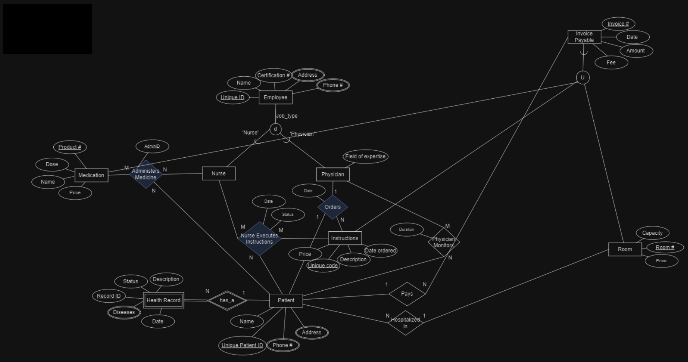

# Hospital Database Project

- **EE-R Requirements**:
  - This hospital has physicians and nurses and gives services to patients.

  - The hospital contains several rooms.

  - Every room has a unique number, capacity, and fee for one night.

  - A patient has a name, unique id, address, and phone number.

  - A patient may have a health record that includes a unique id for each patient, disease, date, status, and description.

  - A physician has a unique id, name, certification number, field of expertise, address, and phone number.

  - A nurse has a unique id, name, certification number, address, and phone number.

  - Every patient is hospitalized in a specific room for some nights.

  - Every patient has some physicians who monitor the patient for a specific duration.

  - A physician orders some instructions for a patient on a specific date.

  - A number of nurses execute the physician’s order for a specific patient on a date, and the execution results in a status.

  - Instruction has a unique code, fee, and description.

  - Nurses also provide medications to patients.

  - Each patient has specific medications, and there is a specific amount of medication that is given to the patient daily by nurses.

  - Patients get medicine from outside pharmacies, so the hospital does not charge them for medicine.

  - All the cares that are provided for a patient are recorded, and the hospital issues an invoice for payable items such as rooms and instructions.

  - Patients make payments for the hospital that includes date and amount.

- **Project Requirements**:
  - Using relations, primary key, and foreign key, create a database schema in your MySQL environment.
  - Populate your database with at least 5 tuples for each table. Put all insert statements in hospital-data.sql.
  - SQL queries (Include at least 15 queries. The set of queries must contain at least three join queries, three aggregation queries, and three nested queries)
  - Provide views, triggers, and transactions within the database.

---

## Databases

- **Technologies**:
  - `.sql` SQL

---

## Tools

- **Version Control**:
  - Git and GitHub
- **DataBase Editor**:
  - MySQL v. 8.0 

---

