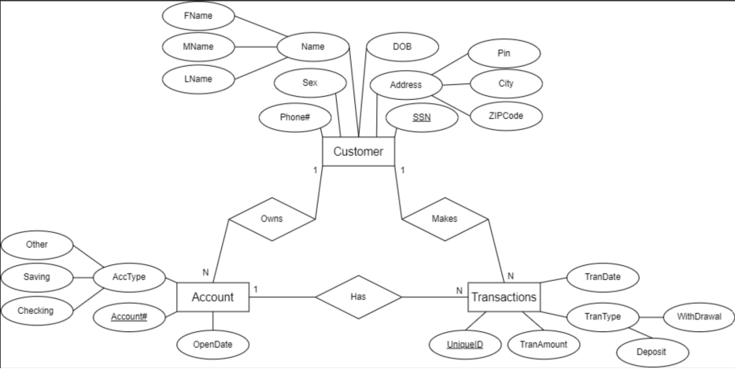

# Bank Database 

- **EE-R Requirements**:
    - The bank keeps the personal information of each customer including name, sex, address, phone number, social security number, and date of birth.
    - Each customer owns one or more bank accounts (The bank does not support a joint account shared with multiple customers).
    - Each bank account is specified with the account number, open date, and type.
    - An account may have several transactions (deposit/withdrawal). A transaction has a unique ID, amount, date, and type.

- **Project Requirements**:
    - Find the total amount of ’Deposit’ transactions at the bank.
    - Find the list of transactions (statement) of September 2019 (09/01/2019 to 09/30/2019) for account ’1111222233331441’ (note: look at the date format).
    - Find the balance of ’1111222233331441’ before 09/01/2019 ((not including 09/01/2019).
    - Find the name of the customer that deposited the highest amount with one transaction (include the transaction amount).
    - List the owner's name of all male customers in the bank who have a ’Checking’ account.
    - Find all accounts associated with ’Alexander Felix’.
    - For each account of the previous question, compute the Balance, and return a table that shows the account number, account type, and balance for each account (hint: use UNION).
    - The list of customer names that have transactions greater than or equal to one thousand dollars. 
        - A) Answer this question using only nested queries (i.e., each select is over only one table).
        - B) Answer this query using joins.
    - The list of customer names that have at least two deposit transactions

---

## Databases

- **Technologies**:
  - `.sql` SQL

---

## Tools

- **Version Control**:
  - Git and GitHub
- **DataBase Editor**:
  - MySQL v. 8.0 

---

