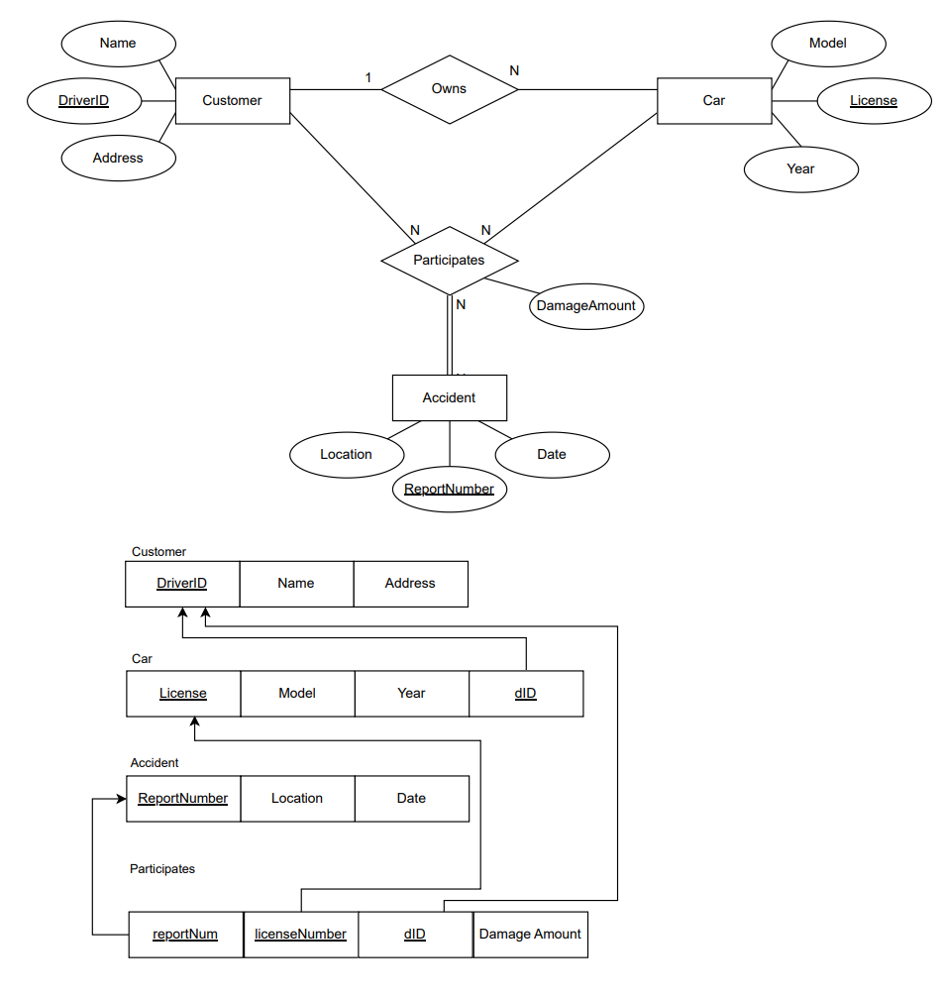

# Insurance Company Database

- **EE-R Requirements**:
    - Each customer has a driver id, name, and address.
    - Each car has a license, model, and year.
    - Each accident identifies with a report number and has location and date.
    - Customers may own more than one cars.
    - A car can be owned by at most one customer.
    - A car may participate in an accident with a damage amount.
    - For a car that participates in an accident there is a responsible driver (Hint: you should consider drivers as customers here, since drivers are the policy holders).
    - Each car may be associated with zero or more recorded accidents.
    - A customer may be involved in more than one recorded accidents with more than one cars s/he has owned (Hint: use 3nary relation).
- **Project Requirements**:
  - Implement the database to a SQL environment.

---

## Databases

- **Technologies**:
  - `.sql` SQL

---

## Tools

- **Version Control**:
  - Git and GitHub
- **DataBase Editor**:
  - MySQL v. 8.0 

---

