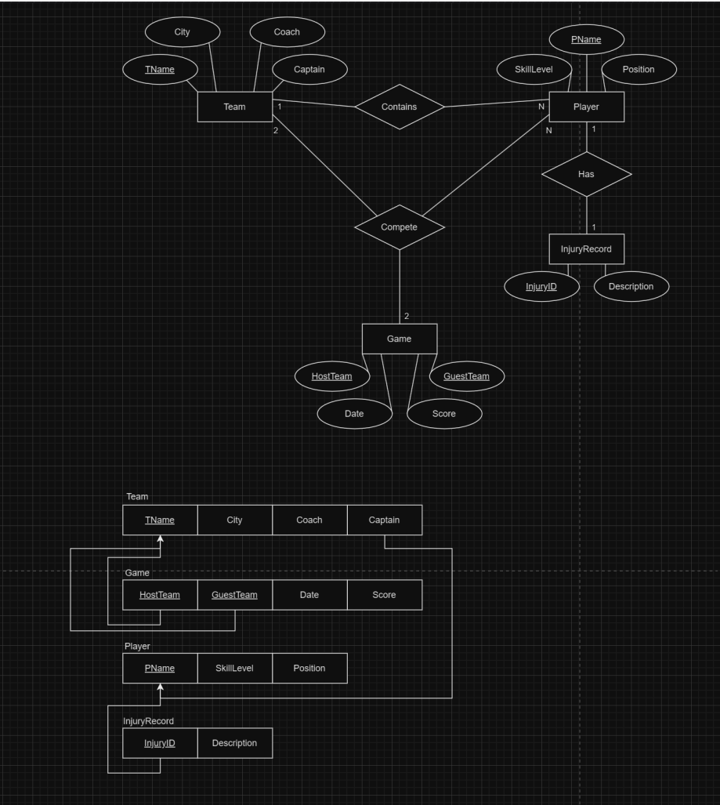

# NHL Database

- **EE-R Requirements**:
    - NHL in each season has many teams (NHL is schema here not an entity).
    - Each team has a name, a city, a coach, a captain, and a set of players.
    - Each player belongs to only one team.
    - Each player has a name, a position (such as left-winger or goalie), a skill level, and a set of injury records.
    - An injury record has id and description.
    - A team captain is also a player.
    - A game is played between two teams (referred to as host_team and guest_team) and has a date (such as May 11th, 1999) and a score (such as 4-2, host number is at left).
    - Two teams only play twice against each other, one as a host and one as a guest.

- **Project Requirements**:
  - Populate your database with information of two teams, four players (two for each team, one caption for each team), two games between the teams (each host once), and an injury record.
  - Shows the games as the match between their captain names.

---

## Databases

- **Technologies**:
  - `.sql` SQL

---

## Tools

- **Version Control**:
  - Git and GitHub
- **DataBase Editor**:
  - MySQL v. 8.0 

---

