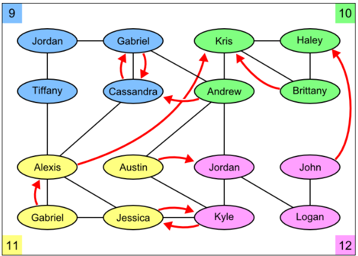

# Social Database

- **Project Requirements**:
  - Write trigger "friendly_trigger" that makes new students named 'Friendly' automatically like everyone else in their grade. That is, after the trigger runs, we should have ('Friendly', A) in the Likes table for every other Highschooler A in the same grade as 'Friendly'.
  - We want to make sure that when we add <id1, id2> into the Friend table, the tuple <id2, id1> is also inserted into the Friend table. Write stored procedure "insert_friend" that takes two input parameters (ID1 and ID2) of type INT as the ID of highschooler and insert two tuples in the Friend. Make sure to insert the tuples if they do not already exist in the Friend table. For example, we run "call insert_friend (1934, 1661);".
  - Write trigger "auto_inc_highschooler" that assigns an ID to a new highschooler when the inserted ID is NULL. The assigned ID must be the largest ID among Highschooler plus one. For example, if we insert (NULL, 'Josh', 8) into Highschooler then the inserted tuple is <1935, 'Josh', 8>.
  - Create view "full_friend" that shows the full information of highschoolers that are friends with each other.  The tuples in full friend have the form of <name1, grade1, name2, grade2'>.  
  - Using full_friend find the name of highschooler that are friend but they are not in the same grade. The output is in the form of <name1, name2>. 

---

## Databases

- **Technologies**:
  - `.sql` SQL

---

## Tools

- **Version Control**:
  - Git and GitHub
- **DataBase Editor**:
  - MySQL v. 8.0 

---

